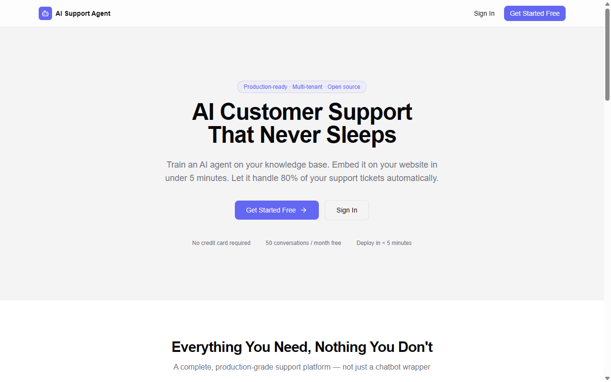
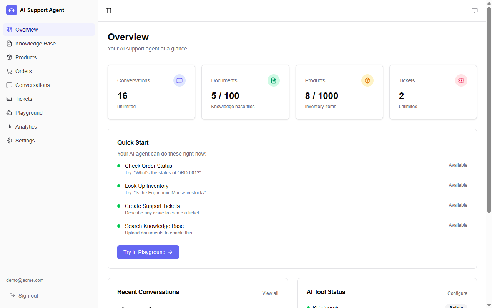
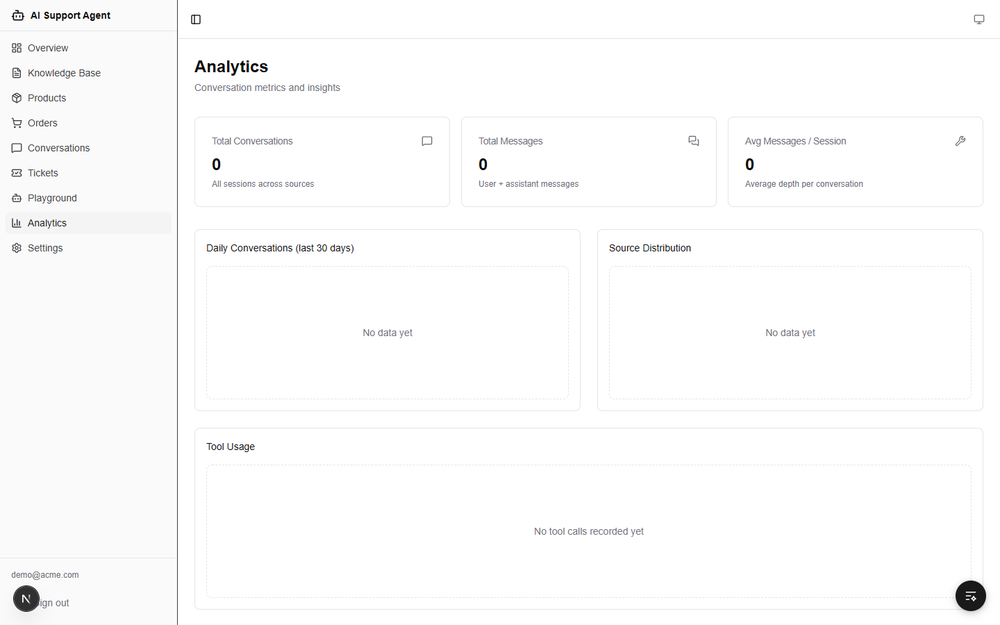
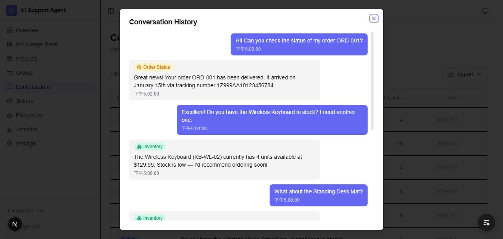
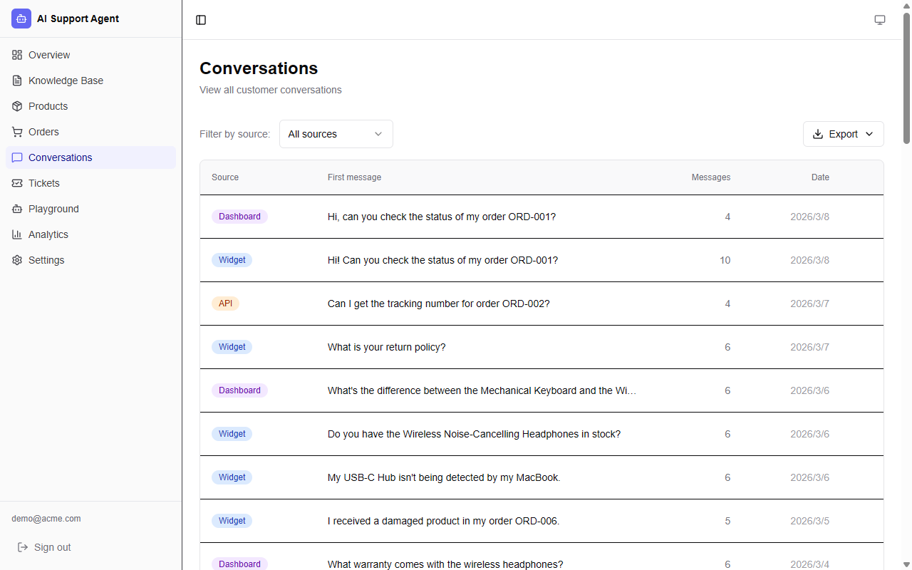
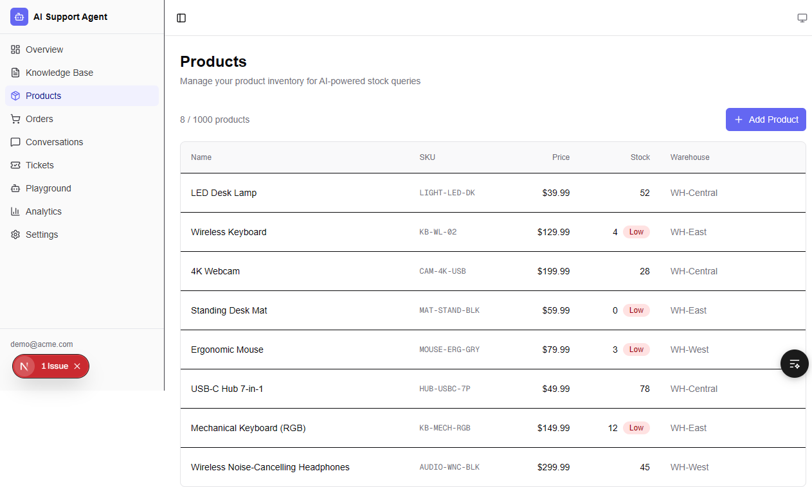
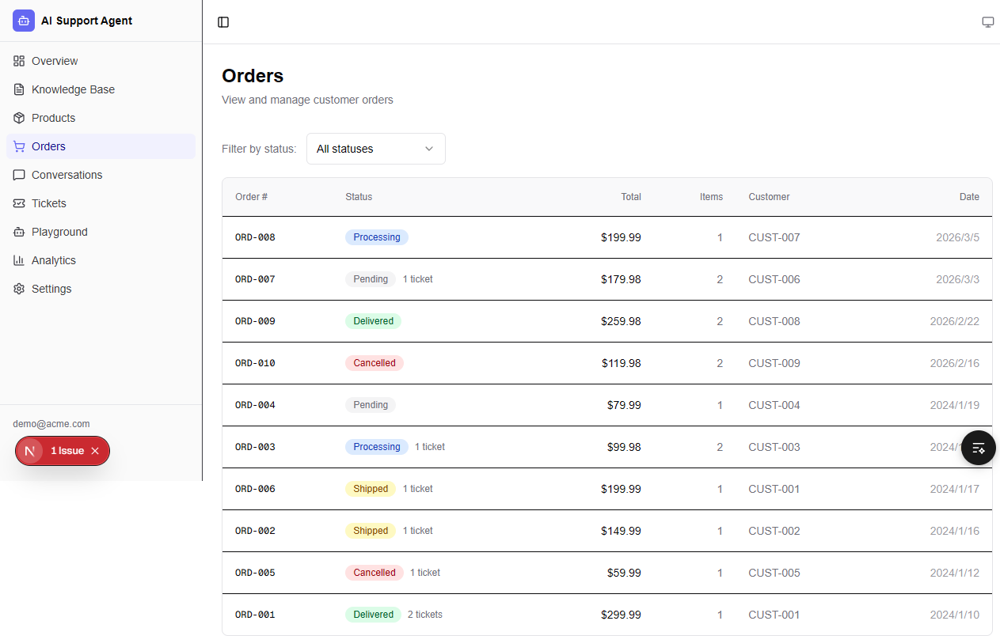
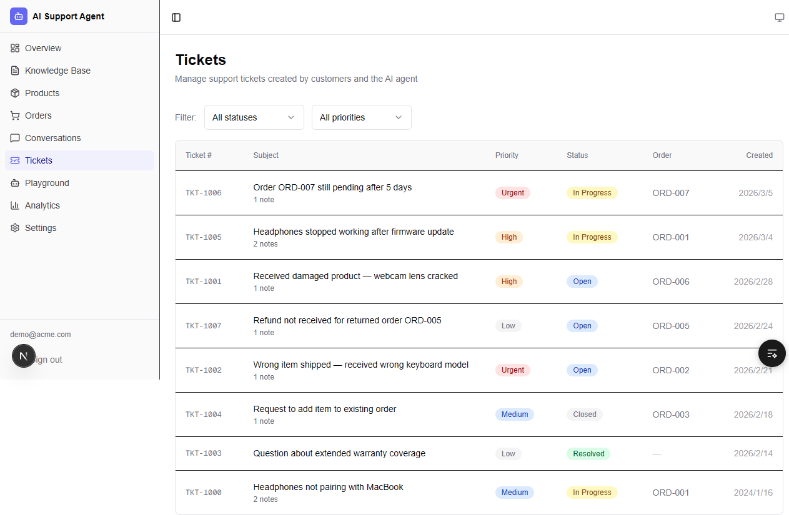
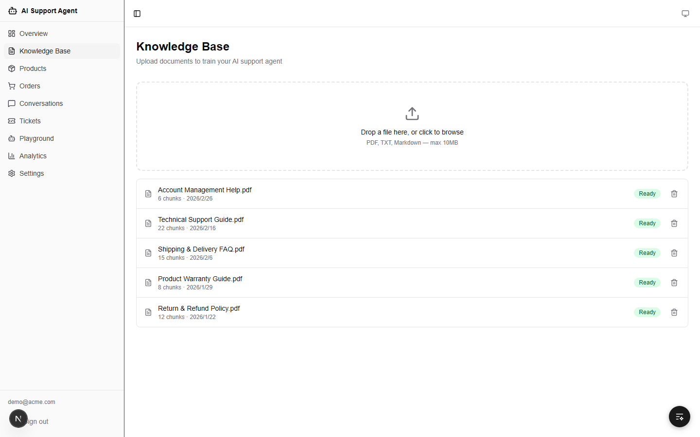
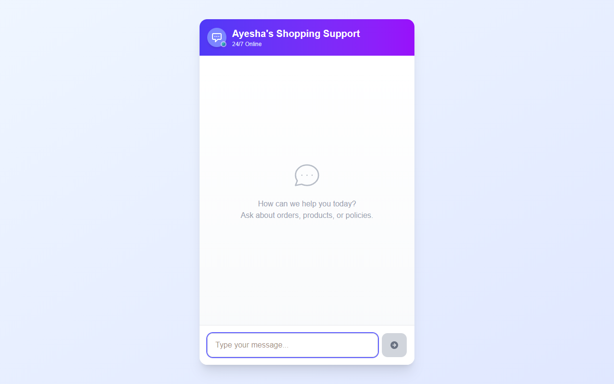

# AI Support Agent

A production-grade, multi-tenant AI customer support SaaS. Train an intelligent agent on your knowledge base, embed a chat widget on any website, and let AI resolve customer queries instantly — with order lookup, inventory check, and ticket escalation built in.

**Live Demo** → [ai-support-agent-tau.vercel.app](https://ai-support-agent-tau.vercel.app)

---

## Screenshots





















---

## Architecture

```
┌─────────────────────────────────────────────────────────────────┐
│                         Customer Website                        │
│   <iframe src="/widget/sk_xxx" />  (drop-in embed, 1 line)      │
└──────────────────────────────┬──────────────────────────────────┘
                               │ API key auth
┌──────────────────────────────▼──────────────────────────────────┐
│                      Next.js App (Vercel)                       │
│                                                                 │
│  ┌─────────────┐    ┌──────────────────────────────────────┐   │
│  │  Dashboard  │    │          AI Agent Pipeline           │   │
│  │  (React 19) │    │                                      │   │
│  │             │    │  User message                        │   │
│  │  • KB Mgmt  │    │      │                               │   │
│  │  • Analytics│    │      ▼                               │   │
│  │  • Orders   │    │  RAG: embed query → pgvector search  │   │
│  │  • Tickets  │    │      │  (Google Gemini embeddings)   │   │
│  │  • Settings │    │      ▼                               │   │
│  └─────────────┘    │  Tool-calling LLM (Groq / Llama 3)   │   │
│                     │      │                               │   │
│                     │      ├─→ searchKnowledgeBase         │   │
│                     │      ├─→ getOrderStatus    ──→ DB    │   │
│                     │      ├─→ checkInventory    ──→ DB    │   │
│                     │      └─→ createTicket      ──→ DB    │   │
│                     │                                      │   │
│                     │  Streamed response to widget         │   │
│                     └──────────────────────────────────────┘   │
└────────────────────────────────┬────────────────────────────────┘
                                 │ Prisma
              ┌──────────────────▼──────────────────┐
              │     Neon PostgreSQL + pgvector        │
              │   17 models · vector similarity      │
              │   search · multi-tenant by orgId     │
              └──────────────────────────────────────┘
```

---

## Features

| Feature                     | Details                                                                              |
| --------------------------- | ------------------------------------------------------------------------------------ |
| **RAG Knowledge Base**      | Upload PDF/TXT/MD → auto-chunk → embed → pgvector semantic search                    |
| **AI Agent (Tool-calling)** | Groq Llama 3 with 4 tools: KB search, order lookup, inventory check, ticket creation |
| **Embeddable Widget**       | 1-line iframe embed, API key authenticated, streaming responses                      |
| **Stripe Billing**          | Free / Pro plans with usage limits and checkout flow                                 |
| **Team Management**         | Invite members via email, role-based access (owner / member)                         |
| **Order Management**        | Track orders with status, tracking number, estimated delivery                        |
| **Product Inventory**       | SKU-based inventory with stock levels and reorder thresholds                         |
| **Support Tickets**         | AI-created tickets with priority, SLA, and escalation notes                          |
| **Analytics**               | Conversation volume, resolution rate, response time charts                           |
| **Auth**                    | NextAuth v5 — email/password with verification, OAuth-ready                          |
| **Security**                | Rate limiting, CSP/HSTS headers, SHA-256 API key hashing, input sanitization         |
| **Multi-tenant**            | Full org isolation — all queries scoped by `orgId`                                   |

---

## Tech Stack

| Layer          | Technology                                               |
| -------------- | -------------------------------------------------------- |
| **Framework**  | Next.js 16 (App Router) + React 19                       |
| **Styling**    | Tailwind CSS v4 + Radix UI                               |
| **Auth**       | NextAuth v5 (beta) — email/password + email verification |
| **Database**   | Prisma 7 + Neon PostgreSQL (pgvector)                    |
| **LLM**        | Vercel AI SDK + Groq (Llama 3.3 70B)                     |
| **Embeddings** | Google Gemini (text-embedding-004)                       |
| **Payments**   | Stripe — checkout + webhook                              |
| **Email**      | Resend — verification + password reset                   |
| **UI**         | Lucide React + Recharts + shadcn/ui                      |
| **Testing**    | Vitest (78 tests)                                        |
| **CI/CD**      | GitHub Actions — lint + type-check + test + build        |

---

## Project Structure

```
src/
  app/
    (auth)/              # Login, register, forgot/reset password
    (dashboard)/         # Overview, KB, conversations, analytics,
                         # orders, products, tickets, settings
    widget/[apiKey]/     # Embeddable customer-facing chat widget
    api/                 # REST API routes (auth, chat, documents,
                         # orders, products, tickets, team, stripe, analytics)
  lib/
    ai/                  # Agent orchestration, 4 tools, prompts
    rag/                 # Embedding, text-splitter, vector-search, doc processor
    plan/                # Plan limits (free/pro), usage checks
    email/               # Resend integration (verify, reset, invite)
  __tests__/             # Vitest unit + integration tests
prisma/
  schema.prisma          # 17 models: Organization, User, UserOrganization,
                         # Document, Embedding, ChatSession, ChatMessage,
                         # AgentSettings, Product, Order, OrderItem, Ticket,
                         # TicketNote, Invitation, Account, Session, VerificationToken
```

---

## Getting Started

### Prerequisites

- Node.js 20+
- pnpm
- [Neon](https://neon.tech) PostgreSQL (enable pgvector extension)
- [Groq](https://console.groq.com) API key
- [Google AI Studio](https://aistudio.google.com) API key (Gemini embeddings)
- [Stripe](https://stripe.com) account (optional — for billing)
- [Resend](https://resend.com) API key (optional — for email; falls back to console log in dev)

### Setup

```bash
# 1. Clone and install
git clone https://github.com/aim840912/ai-support-agent
cd ai-support-agent
pnpm install

# 2. Configure environment
cp .env.example .env.local
```

Edit `.env.local`:

```env
# Required
DATABASE_URL=                       # Neon connection string (with ?sslmode=require)
AUTH_SECRET=                        # openssl rand -base64 32
AUTH_URL=http://localhost:3000
NEXT_PUBLIC_APP_URL=http://localhost:3000
GOOGLE_GENERATIVE_AI_API_KEY=       # Gemini text-embedding-004
GROQ_API_KEY=                       # Groq LLM

# Optional — app works without these (dev fallbacks active)
RESEND_API_KEY=                     # Email delivery
STRIPE_SECRET_KEY=                  # Billing
STRIPE_WEBHOOK_SECRET=
NEXT_PUBLIC_STRIPE_PRICE_ID=
```

```bash
# 3. Push schema + enable pgvector
pnpm prisma db push

# 4. Start development server
pnpm dev
```

Open [http://localhost:3000](http://localhost:3000).

### Available Scripts

```bash
pnpm dev           # Start dev server (Turbopack)
pnpm build         # Production build
pnpm test          # Run 78 Vitest tests
pnpm test:watch    # Watch mode
pnpm lint          # ESLint
pnpm type-check    # TypeScript (no emit)
```

---

## Embedding the Widget

After registering, go to **Settings → Widget Integration** to get your embed code:

```html
<!-- Add to any website — replace with your API key -->
<iframe
  src="https://ai-support-agent-tau.vercel.app/widget/sk_YOUR_API_KEY"
  width="400"
  height="600"
  style="border: none; border-radius: 16px; box-shadow: 0 4px 24px rgba(0,0,0,0.12);"
></iframe>
```

The widget authenticates via the API key, isolates all conversations to your organization, and enforces plan-based usage limits automatically.

---

## Plan Limits

| Feature                 | Free               | Pro                   |
| ----------------------- | ------------------ | --------------------- |
| Documents               | 5                  | 100                   |
| Conversations / month   | 50                 | Unlimited             |
| Messages / conversation | 20                 | Unlimited             |
| Products                | 10                 | 1,000                 |
| Team members            | 3                  | 20                    |
| AI Tools                | KB search + Orders | + Inventory + Tickets |

---

## Security Highlights

- **API keys** — SHA-256 hashed in DB; raw key shown once at creation
- **Rate limiting** — sliding window on all sensitive endpoints (register, login, reset, widget chat)
- **Input sanitization** — Zod validation on all API inputs; parameterized queries via Prisma
- **File validation** — Magic byte verification for document uploads
- **Security headers** — CSP, HSTS, X-Frame-Options, X-Content-Type-Options
- **Auth** — bcrypt (cost 12), email verification required before login, anti-enumeration on register

---

## License

MIT
