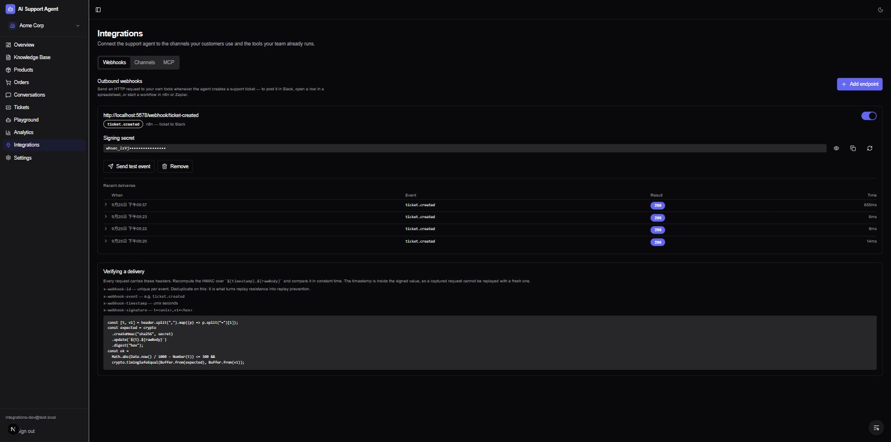
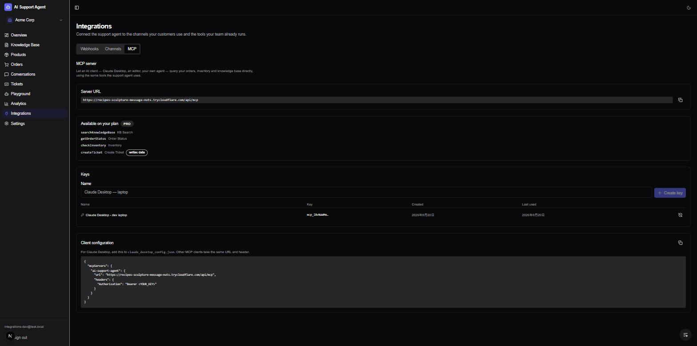

# AI Support Agent

A production-grade, multi-tenant AI customer support SaaS. Train an intelligent agent on your knowledge base, embed a chat widget on any website, and let AI resolve customer queries instantly — with order lookup, inventory check, and ticket escalation built in.

**Live Demo** → [ai-support-agent-tau.vercel.app](https://ai-support-agent-tau.vercel.app)

---

## Screenshots






---

## Architecture

```
  Customers                          Your team's tools
  ─────────                          ─────────────────
  Website widget ─┐                        ▲        ▲
  Telegram bot  ──┤                        │        │
                  │              ticket.created   MCP tools
                  ▼               (HMAC-signed)  (per-plan)
      ┌───────────────────────────────────────────────────┐
      │              Next.js App (Vercel)                 │
      │                                                   │
      │  prepareChat()  session · plan limits · agent      │
      │        │                                          │
      │        ├─ streamChatResponse()  → SSE (web)       │
      │        └─ generateChatReply()   → text (Telegram) │
      │                     │                             │
      │        Tool registry (one zod schema per tool)    │
      │            ├─ searchKnowledgeBase → pgvector      │
      │            ├─ getOrderStatus      → DB            │
      │            ├─ checkInventory      → DB            │
      │            └─ createTicket        → DB → webhooks │
      │                     ▲                             │
      │                     └── also served over MCP      │
      └───────────────────────────┬───────────────────────┘
                                  │ Prisma
                  ┌───────────────▼────────────────┐
                  │   Neon PostgreSQL + pgvector   │
                  │  multi-tenant, scoped by orgId │
                  └────────────────────────────────┘
```

The three surfaces — widget, Telegram, MCP — share one pipeline and one tool
registry rather than each carrying a copy. Adding Telegram changed zero lines
in the existing chat routes; see [docs/integrations.md](docs/integrations.md).

---

## Features

| Feature                     | Details                                                                                               |
| --------------------------- | ----------------------------------------------------------------------------------------------------- |
| **RAG Knowledge Base**      | Upload PDF/TXT/MD → auto-chunk → embed → pgvector semantic search                                     |
| **AI Agent (Tool-calling)** | 4 tools: KB search, order lookup, inventory check, ticket creation — shared by chat, Telegram and MCP |
| **Embeddable Widget**       | 1-line iframe embed, API key authenticated, streaming responses                                       |
| **Stripe Billing**          | Free / Pro plans with usage limits and checkout flow                                                  |
| **Team Management**         | Invite members via email, role-based access (owner / member)                                          |
| **Order Management**        | Track orders with status, tracking number, estimated delivery                                         |
| **Product Inventory**       | SKU-based inventory with stock levels and reorder thresholds                                          |
| **Support Tickets**         | AI-created tickets with priority, SLA, and escalation notes                                           |
| **Analytics**               | Conversation volume, resolution rate, response time charts                                            |
| **Auth**                    | NextAuth v5 — email/password with verification, OAuth-ready                                           |
| **Security**                | Rate limiting, CSP/HSTS headers, SHA-256 API key hashing, input sanitization                          |
| **Multi-tenant**            | Full org isolation — all queries scoped by `orgId`                                                    |
| **Telegram channel**        | Customers chat with the agent from a Telegram bot; same tools, same transcript                        |
| **Outbound webhooks**       | HMAC-signed `ticket.created` events with delivery history and auto-disable                            |
| **MCP server**              | Any MCP client can call the four tools; the list is gated per plan, per request                       |

---

## Tech Stack

| Layer          | Technology                                               |
| -------------- | -------------------------------------------------------- |
| **Framework**  | Next.js 16 (App Router) + React 19                       |
| **Styling**    | Tailwind CSS v4 + Radix UI                               |
| **Auth**       | NextAuth v5 (beta) — email/password + email verification |
| **Database**   | Prisma 7 + Neon PostgreSQL (pgvector)                    |
| **LLM**        | Vercel AI SDK v6 + OpenRouter (free tier with fallbacks) |
| **Embeddings** | Google Gemini (text-embedding-004)                       |
| **Payments**   | Stripe — checkout + webhook                              |
| **Email**      | Resend — verification + password reset                   |
| **UI**         | Lucide React + Recharts + shadcn/ui                      |
| **Testing**    | Vitest (254 tests)                                       |
| **CI/CD**      | GitHub Actions — lint + type-check + test + build        |

---

## Project Structure

```
src/
  app/
    (auth)/              # Login, register, forgot/reset password
    (dashboard)/         # Overview, KB, conversations, analytics,
                         # orders, products, tickets, settings
    widget/[apiKey]/     # Embeddable customer-facing chat widget
    api/                 # REST API routes (auth, chat, documents,
                         # orders, products, tickets, team, stripe, analytics)
  lib/
    ai/                  # Agent orchestration, 4 tools, prompts
    rag/                 # Embedding, text-splitter, vector-search, doc processor
    plan/                # Plan limits (free/pro), usage checks
    email/               # Resend integration (verify, reset, invite)
  __tests__/             # Vitest unit + integration tests
prisma/
  schema.prisma          # 21 models: Organization, User, UserOrganization,
                         # Document, Embedding, ChatSession, ChatMessage,
                         # AgentSettings, Product, Order, OrderItem, Ticket,
                         # TicketNote, Invitation, Account, Session, VerificationToken,
                         # TelegramChannel, WebhookEndpoint, WebhookDelivery, IntegrationKey
```

---

## Getting Started

### Prerequisites

- Node.js 20+
- pnpm
- [Neon](https://neon.tech) PostgreSQL (enable pgvector extension)
- [OpenRouter](https://openrouter.ai) API key (free-tier models work)
- [Google AI Studio](https://aistudio.google.com) API key (Gemini embeddings)
- [Stripe](https://stripe.com) account (optional — for billing)
- [Resend](https://resend.com) API key (optional — for email; falls back to console log in dev)

### Setup

```bash
# 1. Clone and install
git clone https://github.com/aim840912/ai-support-agent
cd ai-support-agent
pnpm install

# 2. Configure environment
cp .env.example .env.local
```

Edit `.env.local`:

```env
# Required
DATABASE_URL=                       # Neon connection string (with ?sslmode=require)
AUTH_SECRET=                        # openssl rand -base64 32
AUTH_URL=http://localhost:3000
NEXT_PUBLIC_APP_URL=http://localhost:3000
GOOGLE_GENERATIVE_AI_API_KEY=       # Gemini text-embedding-004
OPENROUTER_API_KEY=                 # LLM (free-tier models, with fallbacks)

# Optional — app works without these (dev fallbacks active)
RESEND_API_KEY=                     # Email delivery
STRIPE_SECRET_KEY=                  # Billing
STRIPE_WEBHOOK_SECRET=
NEXT_PUBLIC_STRIPE_PRICE_ID=
INTEGRATION_ENCRYPTION_KEY=         # openssl rand -base64 32 — encrypts channel credentials
INTEGRATIONS_PUBLIC_URL=            # Only if callbacks must reach a different host than NEXT_PUBLIC_APP_URL
```

```bash
# 3. Push schema + enable pgvector
pnpm prisma db push

# 4. Start development server
pnpm dev
```

Open [http://localhost:3000](http://localhost:3000).

### Available Scripts

```bash
pnpm dev           # Start dev server (Turbopack)
pnpm build         # Production build
pnpm test          # Run 78 Vitest tests
pnpm test:watch    # Watch mode
pnpm lint          # ESLint
pnpm type-check    # TypeScript (no emit)
```

---

## Embedding the Widget

After registering, go to **Settings → Widget Integration** to get your embed code:

```html
<!-- Add to any website — replace with your API key -->
<iframe
  src="https://ai-support-agent-tau.vercel.app/widget/sk_YOUR_API_KEY"
  width="400"
  height="600"
  style="border: none; border-radius: 16px; box-shadow: 0 4px 24px rgba(0,0,0,0.12);"
></iframe>
```

The widget authenticates via the API key, isolates all conversations to your organization, and enforces plan-based usage limits automatically.

---

## Integrations

Full guide: **[docs/integrations.md](docs/integrations.md)**

|                       |                                                                                                                                                                  |
| --------------------- | ---------------------------------------------------------------------------------------------------------------------------------------------------------------- |
| **Telegram**          | Paste a token from @BotFather. The bot answers with the same agent, tools and transcript as the widget; conversations appear in the dashboard tagged `telegram`. |
| **Outbound webhooks** | HMAC-signed `ticket.created` events. The dashboard shows recent deliveries with status and timing, and sends a test event on demand.                             |
| **MCP server**        | `/api/mcp` over Streamable HTTP. Issue a key, paste it into Claude Desktop or any MCP client, and the four tools are available — gated by plan.                  |

`docs/n8n-ticket-to-slack.json` is an importable n8n workflow that verifies
the signature and formats the ticket for a chat message. It was tested by
importing it into n8n and firing a real event at it: a signed request reaches
the Slack step, an unsigned one is answered 401.

`scripts/webhook-receiver.mjs` is the documented verification snippet wrapped
in a server, for checking an endpoint without any automation tool:

```bash
node scripts/webhook-receiver.mjs <signing-secret> 5678
```

---

## Plan Limits

| Feature                 | Free               | Pro                   |
| ----------------------- | ------------------ | --------------------- |
| Documents               | 5                  | 100                   |
| Conversations / month   | 50                 | Unlimited             |
| Messages / conversation | 20                 | Unlimited             |
| Products                | 10                 | 1,000                 |
| Team members            | 3                  | 20                    |
| AI Tools                | KB search + Orders | + Inventory + Tickets |

---

## Security Highlights

- **API keys** — SHA-256 hashed in DB; raw key shown once at creation
- **Rate limiting** — sliding window on all sensitive endpoints (register, login, reset, widget chat)
- **Input sanitization** — Zod validation on all API inputs; parameterized queries via Prisma
- **File validation** — Magic byte verification for document uploads
- **Security headers** — CSP, HSTS, X-Frame-Options, X-Content-Type-Options
- **Auth** — bcrypt (cost 12), email verification required before login, anti-enumeration on register
- **Integration credentials** — MCP keys stored as a hash and revocable individually; the public widget key is deliberately rejected by the MCP endpoint
- **Third-party tokens** — Telegram bot tokens encrypted at rest (AES-256-GCM); [why webhook secrets are not](docs/integrations.md#why-encrypt-bot-tokens-but-not-webhook-secrets)
- **Webhook delivery** — HMAC-SHA256 over the timestamp and raw body, compared in constant time; destinations blocked from loopback and private ranges

---

## License

MIT
